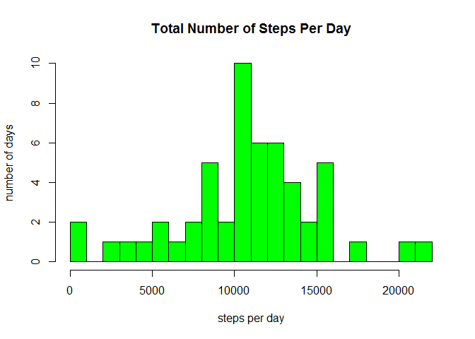
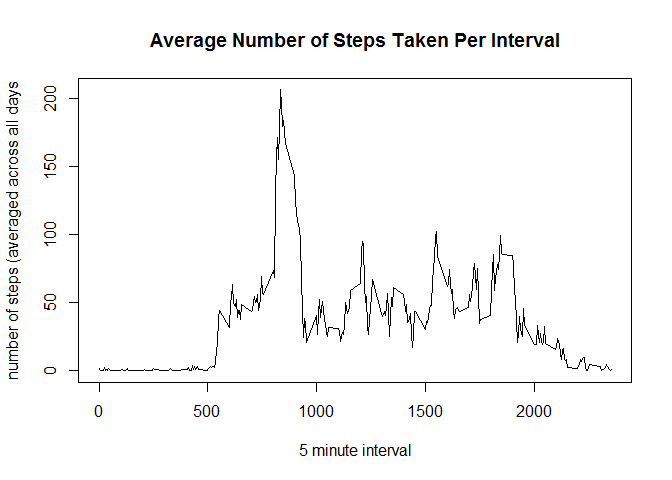
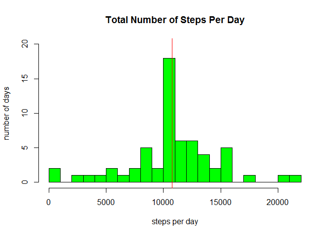
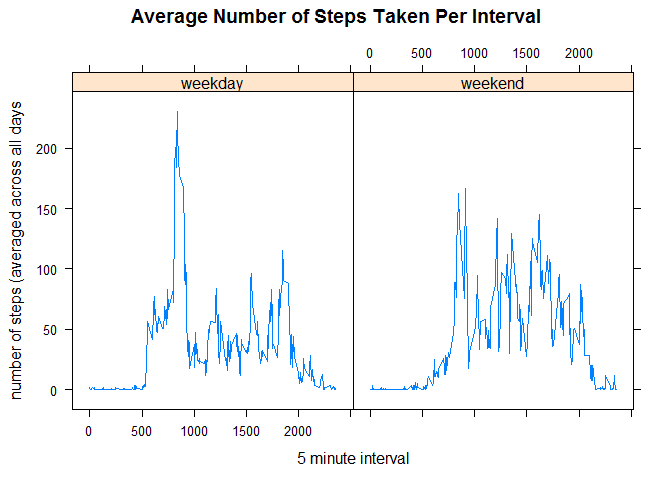

# Reproducible Research: Peer Assessment 1


```r
## include the required libraries 
library(lattice)
library(dplyr)
```

```
## 
## Attaching package: 'dplyr'
```

```
## The following objects are masked from 'package:stats':
## 
##     filter, lag
```

```
## The following objects are masked from 'package:base':
## 
##     intersect, setdiff, setequal, union
```

## Loading and preprocessing the data

```r
##fileurl <- "https://d396qusza40orc.cloudfront.net/repdata%2Fdata%2Factivity.zip"
##if (!file.exists("./data")){dir.create("./data")}

##download.file(fileurl, destfile = "./data/activity.zip")
##unzip("./data/activity.zip", exdir = "./data")

activity <- read.csv("./data/activity.csv")
str(activity)
```

```
## 'data.frame':	17568 obs. of  3 variables:
##  $ steps   : int  NA NA NA NA NA NA NA NA NA NA ...
##  $ date    : Factor w/ 61 levels "2012-10-01","2012-10-02",..: 1 1 1 1 1 1 1 1 1 1 ...
##  $ interval: int  0 5 10 15 20 25 30 35 40 45 ...
```

```r
summary(activity)
```

```
##      steps                date          interval     
##  Min.   :  0.00   2012-10-01:  288   Min.   :   0.0  
##  1st Qu.:  0.00   2012-10-02:  288   1st Qu.: 588.8  
##  Median :  0.00   2012-10-03:  288   Median :1177.5  
##  Mean   : 37.38   2012-10-04:  288   Mean   :1177.5  
##  3rd Qu.: 12.00   2012-10-05:  288   3rd Qu.:1766.2  
##  Max.   :806.00   2012-10-06:  288   Max.   :2355.0  
##  NA's   :2304     (Other)   :15840
```

Data has NA's.  Here we remove missing values for the 1st part of the assignment.

```r
activity_no_na <- activity[complete.cases(activity),]  
```

## What is mean total number of steps taken per day?

1. Calculate the total number of steps taken per day

```r
steps_day <- aggregate(steps ~ date, activity_no_na, sum)
str(steps_day)
```

```
## 'data.frame':	53 obs. of  2 variables:
##  $ date : Factor w/ 61 levels "2012-10-01","2012-10-02",..: 2 3 4 5 6 7 9 10 11 12 ...
##  $ steps: int  126 11352 12116 13294 15420 11015 12811 9900 10304 17382 ...
```
Aggregate results show 53 days.  There were no activity measurements taken on 8 days out of 61.


```r
head(steps_day)
```

```
##         date steps
## 1 2012-10-02   126
## 2 2012-10-03 11352
## 3 2012-10-04 12116
## 4 2012-10-05 13294
## 5 2012-10-06 15420
## 6 2012-10-07 11015
```

2.  Make a Histogram of the total number of steps taken each day.

```r
hist(steps_day$steps, breaks = 20, col="green",
     main = "Total Number of Steps Per Day", 
     xlab = "steps per day",
     ylab = "number of days")
```

<!-- -->


3. Calculate and report the mean and median of the total number of steps taken per day

```r
mean(steps_day$steps) 
```

```
## [1] 10766.19
```

```r
median(steps_day$steps)
```

```
## [1] 10765
```
## What is the average daily activity pattern?

1.  Make a time series plot (i.e. type = "l") of the 5-minute interval (x-axis) and the average number of steps taken, averaged across all days (y-axis)

First we calculate the average number of steps taken, averaged across all days, for each 5-minute interval.

```r
interval_ave <- aggregate(steps ~ interval, activity_no_na, mean)
head(interval_ave)
```

```
##   interval     steps
## 1        0 1.7169811
## 2        5 0.3396226
## 3       10 0.1320755
## 4       15 0.1509434
## 5       20 0.0754717
## 6       25 2.0943396
```
Next we create the time series plot.

```r
with(interval_ave, plot(interval, steps, type = "l",
                        main = "Average Number of Steps Taken Per Interval",
                        xlab = "5 minute interval",
                        ylab = "number of steps (averaged across all days"))
```

<!-- -->

2.  Which 5-minute interval, on average across all the days in the dataset, contains the maximum number of steps?


```r
interval_ave[interval_ave$steps == max(interval_ave$steps),]
```

```
##     interval    steps
## 104      835 206.1698
```

On average across all the days, the 5-minute interval 835 (which corresponds to 8 and a half hours into each day) contains the maximum number of steps.  The peak in the plot occurs at this 5-min interval.

## Imputing missing values
1.  Calculate and report the total number of missing values in the dataset (i.e. the total number of rows with NAs)

```r
sum(is.na(activity))
```

```
## [1] 2304
```

2.  Devise a strategy for filling in all of the missing values in the dataset. The strategy does not need to be sophisticated. For example, you could use the mean/median for that day, or the mean for that 5-minute interval, etc.

Strategy chosen: We will use the mean for that 5-minute interval.

3.  Create a new dataset that is equal to the original dataset but with the missing data filled in.


```r
##subset the rows with missing values
activity_na <- subset(activity, is.na(activity$steps)) 

##update the NA values with the matching interval average
activity_na$steps <- interval_ave[match(activity_na$interval, interval_ave$interval),2]

##combine the updated NA rows and the Non-NA rows to create a new dataset. 
activity_new <- rbind(activity_na, activity_no_na) 
```

4.  Make a histogram of the total number of steps taken each day and Calculate and report the mean and median total number of steps taken per day. Do these values differ from the estimates from the first part of the assignment? What is the impact of imputing missing data on the estimates of the total daily number of steps?


```r
steps_day_new <- aggregate(steps ~ date, activity_new, sum)
str(steps_day_new)
```

```
## 'data.frame':	61 obs. of  2 variables:
##  $ date : Factor w/ 61 levels "2012-10-01","2012-10-02",..: 1 2 3 4 5 6 7 8 9 10 ...
##  $ steps: num  10766 126 11352 12116 13294 ...
```

```r
head(steps_day_new)
```

```
##         date    steps
## 1 2012-10-01 10766.19
## 2 2012-10-02   126.00
## 3 2012-10-03 11352.00
## 4 2012-10-04 12116.00
## 5 2012-10-05 13294.00
## 6 2012-10-06 15420.00
```

```r
hist(steps_day_new$steps, breaks = 20, col="green",
     main = "Total Number of Steps Per Day", 
     xlab = "steps per day",
     ylab = "number of days",
     ylim = c(0,20))
abline(v=mean(steps_day_new$steps), col = "red")
```

<!-- -->

```r
mean(steps_day_new$steps) 
```

```
## [1] 10766.19
```

```r
median(steps_day_new$steps)
```

```
## [1] 10766.19
```
The mean number of steps remained the same as the value obtained in the first part of the assignment.
The median also remained very close to the value in the first part of the assignment (just up by 1 step).

The impact of imputing missing data will depend on the strategy used to populate the missing values.  In this case, because we used the mean for the given interval, the resulting summaries remained almost the same.  

We can see in the histogram that all the bars remained the same height except bar with the mean, which increased in height from 10 to 18 days.  The additional 8 are the days where we filled in the missing values using the interval means.

## Are there differences in activity patterns between weekdays and weekends?

1.  Create a new factor variable in the dataset with two levels - "weekday" and "weekend" indicating whether a given date is a weekday or weekend day.

```r
activity_new <- mutate(activity_new, day = weekdays(as.Date(date)),
                       daytype = ifelse(day %in% c("Saturday", "Sunday"), "weekend", "weekday"))
activity_new$daytype <- as.factor(activity_new$daytype) 
head(activity_new)
```

```
##       steps       date interval    day daytype
## 1 1.7169811 2012-10-01        0 Monday weekday
## 2 0.3396226 2012-10-01        5 Monday weekday
## 3 0.1320755 2012-10-01       10 Monday weekday
## 4 0.1509434 2012-10-01       15 Monday weekday
## 5 0.0754717 2012-10-01       20 Monday weekday
## 6 2.0943396 2012-10-01       25 Monday weekday
```

2.  Make a panel plot containing a time series plot (i.e. type = "l") of the 5-minute interval (x-axis) and the average number of steps taken, averaged across all weekday days or weekend days (y-axis). See the README file in the GitHub repository to see an example of what this plot should look like using simulated data.


```r
interval_ave_new <- aggregate(steps ~ interval + daytype, activity_new, mean)

xyplot(steps ~ interval | daytype, interval_ave_new, type = "l",
       main = "Average Number of Steps Taken Per Interval",
       xlab = "5 minute interval",
       ylab = "number of steps (averaged across all days")
```

<!-- -->

